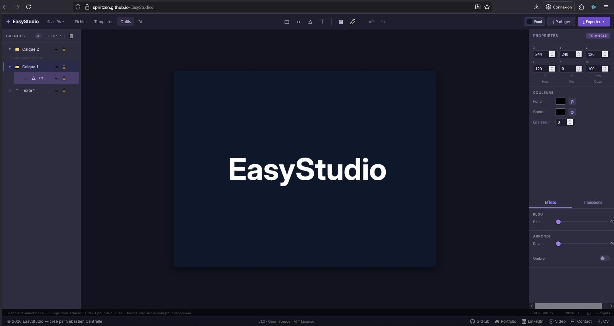

<div align="center">



# ⚡ EasyStudio

### Outil de création visuelle open source
**Logos · Vignettes · Boutons · Animations · Export code**

[](https://spiritzen.github.io/EasyStudio/)
[](https://github.com/Spiritzen)
[](https://spiritzen.github.io/portfolio/)
[](https://www.linkedin.com/in/sebastien-cantrelle-26b695106/)

---

> **EasyStudio** est un Figma light open source,  
> 100% front-end, zéro serveur, déployé sur GitHub Pages.  
> Conçu pour les développeurs qui veulent créer vite et exporter du vrai code.

---

</div>

## 🌍 Demo live

### 👉 [https://spiritzen.github.io/EasyStudio/](https://spiritzen.github.io/EasyStudio/)

---

## ✨ Pourquoi EasyStudio ?

| Besoin | EasyStudio |
|--------|-----------|
| Créer un logo sans Illustrator | ✅ Canvas vectoriel Fabric.js |
| Faire une vignette YouTube/Instagram | ✅ Templates prédéfinis aux bonnes dimensions |
| Animer un bouton et récupérer le CSS | ✅ GSAP + export `@keyframes` |
| Générer du HTML/CSS depuis un design | ✅ Code generator intégré |
| Travailler sans connexion internet | ✅ 100% local, zéro API obligatoire |
| Utiliser l'IA pour générer des SVG | ✅ Module Claude API (clé utilisateur) |

---

## 🚀 Fonctionnalités

### 🎨 Canvas & Outils
- Formes vectorielles — Rectangle, Cercle, Triangle, Ligne, Flèche, Étoile
- Texte — Titre, Sous-titre, Corps, Texte en arc
- Import images — PNG · JPG · SVG · WebP · ICO · GIF
- 3 modes d'import — Upload fichier · Drag & Drop · URL · Ctrl+V
- Suppression de fond automatique (tolérance ajustable)
- Filtres image — Luminosité · Contraste · Saturation · N&B · Blur · Hue
- Tooltips contextuels sur tous les outils avec raccourcis clavier

### 📐 Calques & Hiérarchie
- Système de calques avec groupes logiques (style Photoshop)
- **Drag & drop fluide style Figma** — réordonner et imbriquer avec animation 200ms
- Réordonnancement à la racine ET à l'intérieur des groupes
- Renommage universel double-clic — tous les objets et calques
- Toggle visibilité 👁 et verrouillage 🔒 par calque
- Héritage visibilité/lock sur tous les enfants d'un groupe
- **Suppression avec confirmation** — calque vide ou avec enfants
- **Menu contextuel clic droit** — Renommer · Dupliquer · Monter · Descendre · Supprimer
- Bouton tout supprimer avec confirmation

### 🎯 Effets & Pivot
- **Point de pivot visuel** — grille 3×3 style Figma
  pour contrôler le centre de rotation
- Blur fonctionnel sur toutes les formes
  vectorielles (Rectangle, Cercle, Triangle, Texte)
- Pivot préservé lors des transitions animées

### ⚡ Transitions & Animations
- Système d'États A → B (snapshots du canvas)
- 8 types — Fondu · Glissement · Zoom · Rotation · Retournement · Morphose
- Moteur GSAP — easing, durée, stagger, delay
- Fallback requestAnimationFrame natif si besoin
- Preview live sur le canvas avec bouton Boucle
- **Export CSS `@keyframes` prêt à coller dans votre projet**
- **Export HTML animé autonome téléchargeable**
- Auto-sélection États A/B après capture
- **Bouton Reverse** — joue la transition
  en sens inverse (B → A)
- Rotation et Flip inversés correctement
  en mode Reverse
- Pivot custom pris en compte dans les animations

### 📦 Export multi-format
- SVG → vectoriel, scalable à l'infini
- PNG → haute résolution ×2
- WebP → optimisé web moderne
- JPEG → compression qualité 0.92
- PDF → impression et partage
- HTML/CSS → code d'intégration structuré en couches

### 🤖 Module IA (optionnel)
- Génération de logos SVG par prompt texte
- Analyse de logo existant + suggestions d'amélioration
- Palette de couleurs complémentaires générée par IA
- Clé Anthropic Claude stockée en localStorage — jamais envoyée ailleurs

### 🖼️ Arrière-plan de travail
- Presets rapides — blanc · gris · noir · damier transparent
- Tons sombres populaires — Tailwind · Zinc · Slate · VS Code dark
- Tons clairs — Blanc cassé · Bleu clair · Vert clair
- Couleur personnalisée hex + color picker natif
- Slider opacité 0–100%
- **Non exporté** — aide visuelle uniquement

### 💾 Gestion de projets
- Modal "Nouveau projet" avec titre + format de départ
- Sauvegarde complète au format .easylogo (JSON lisible)
- Rechargement fidèle — canvas, calques, arrière-plan, transitions
- Projets récents (5 derniers) avec miniature et date relative
- Titre de projet éditable directement dans la toolbar

### 🎯 Expérience utilisateur
- **Onboarding modal** au premier lancement — présentation des features
- **Overlay d'accueil** sur canvas vide — 3 actions rapides cliquables
- **Barre de statut contextuelle** — infos selon la sélection + raccourcis
- Placeholders enrichis dans tous les panels — guidage naturel
- Messages d'aide disparaissant après le premier usage

---

## 🛠 Stack technique

| Technologie | Rôle |
|------------|------|
| React 18 | Interface composants |
| TypeScript | Typage strict |
| Vite | Build ultra-rapide |
| Fabric.js v5 | Canvas vectoriel |
| Zustand | State management |
| GSAP | Moteur d'animations |
| jsPDF | Export PDF |
| html2canvas | Capture canvas → image |
| react-colorful | Color picker |
| @dnd-kit | Drag & drop calques style Figma |
| GitHub Pages | Hébergement gratuit |
| GitHub Actions | CI/CD déploiement automatique |

---

## 📐 Templates prédéfinis

| Format | Dimensions | Usage |
|--------|-----------|-------|
| Logo carré | 400×400 | Logo universel |
| Favicon | 64×64 | Icône navigateur |
| Post Instagram | 1080×1080 | Réseaux sociaux |
| Story TikTok | 1080×1920 | Vertical mobile |
| Vignette YouTube | 1280×720 | Miniature vidéo |
| Bannière LinkedIn | 1584×396 | Profil pro |
| Open Graph | 1200×630 | Aperçu lien web |
| Carte de visite | 1050×600 | Print |

---

## ⚙️ Installation locale

```bash
git clone https://github.com/Spiritzen/EasyStudio.git
cd EasyStudio
npm install
npm run dev
```

➡️ Ouvrir **http://localhost:5173/EasyStudio/**

---

## 🚀 Déploiement GitHub Pages

```bash
npm run deploy
```

➡️ **https://spiritzen.github.io/EasyStudio/**

Le déploiement est aussi **automatique via GitHub Actions** à chaque push sur `main`.

---

## 💾 Format de sauvegarde .easylogo

Le format `.easylogo` est un fichier JSON lisible et portable :

```json
{
  "easystudio": true,
  "version": "1.1",
  "title": "Mon logo boulangerie",
  "createdAt": 1234567890,
  "updatedAt": 1234567890,
  "canvas": { "width": 800, "height": 600 },
  "background": { "bgColor": "#2a2a3a", "bgOpacity": 100 },
  "objects": { "...objets Fabric.js sérialisés..." },
  "layers": [ "...hiérarchie des calques..." ],
  "states": [ "...états de transition..." ],
  "thumbnail": "data:image/png;base64,..."
}
```

---

## 📋 Changelog

### v1.2.2 — Pivot & Reverse
- ✨ Point de pivot visuel 3×3 style Figma
- ✨ Bouton Reverse transitions — joue B→A
- ✨ Rotate/Flip correctement inversés en Reverse
- ✨ Pivot sérialisé et préservé dans les transitions
- 🐛 Blur fonctionnel sur formes vectorielles
- 🐛 Import image depuis Fichier → corrigé
- 🐛 centeredRotation false sur pivot custom
- 🔒 Nettoyage repo — .claude/ et audits retirés

### v1.2.1 — Blur vectoriel + nettoyage
- ✨ Blur sur Rectangle, Cercle, Triangle, Texte
- 🔒 .gitignore optimisé React/Vite/TypeScript
- 🔒 Config Claude Code retirée du repo public

### v1.1 — UX & Stabilité
- ✨ Drag & drop hiérarchie style Figma — racine ET dans les groupes
- ✨ Transitions GSAP fonctionnelles — 8 types + export CSS/HTML animé
- ✨ Suppression calques avec confirmation et menu contextuel clic droit
- ✨ Onboarding modal premier lancement
- ✨ Overlay d'accueil canvas vide avec actions rapides
- ✨ Tooltips sur tous les outils avec raccourcis
- ✨ Barre de statut contextuelle
- ✨ CI/CD GitHub Actions — déploiement automatique
- 🐛 Corrections guards canvas (DOMException résolues)
- 🐛 Footer année dynamique `new Date().getFullYear()`
- 🐛 Zoom auto canvas au démarrage et changement template

### v1.0 — Initial Release
- Canvas vectoriel Fabric.js complet
- Import images multi-format + drag & drop + URL + Ctrl+V
- Export SVG · PNG · WebP · JPEG · PDF · HTML/CSS
- Système de calques avec groupes logiques
- Arrière-plan de travail non exporté
- Module IA Claude API optionnel
- Templates prédéfinis 8 formats
- Gestion projets .easylogo

---

## 🏗 Architecture

```
src/
├── components/
│   ├── Toolbar/           # Barre principale + menus
│   ├── LayersPanel/       # Hiérarchie calques + drag & drop
│   ├── Canvas/            # Fabric.js + hooks + zoom
│   ├── Inspector/         # Propriétés objet sélectionné
│   ├── Effects/           # Blur · Ombre · Arrondi · Transitions
│   ├── AIPanel/           # Module Claude API
│   ├── Background/        # Arrière-plan de travail
│   ├── CodeOutput/        # Générateur HTML/CSS
│   ├── UI/                # Toast · Tooltip · Onboarding · StatusBar
│   └── Footer/            # Liens auteur
├── store/
│   ├── canvasStore.ts     # État global canvas + layers
│   ├── exportStore.ts     # Formats d'export
│   ├── transitionStore.ts # États A/B + animations
│   ├── backgroundStore.ts # Arrière-plan
│   ├── uiStore.ts         # Grille · Règles · UI state
│   └── aiStore.ts         # Clé API + historique
└── utils/
    ├── exportUtils.ts      # SVG · PNG · PDF · WebP · JPEG
    ├── codeGenerator.ts    # HTML/CSS depuis canvas
    ├── transitionEngine.ts # GSAP + CSS keyframes + fallback RAF
    ├── zoomUtils.ts        # Zoom auto + fit to view
    └── fabricHelpers.ts    # Helpers Fabric.js
```

---

## 🎯 Philosophie du projet

EasyStudio est né d'un constat simple :
**les designers ont Figma, les développeurs ont besoin d'un outil qui parle leur langage.**

- ✅ Export de **vrai code** HTML/CSS, pas des screenshots
- ✅ Export CSS `@keyframes` pour les animations
- ✅ Zéro serveur, zéro compte, zéro abonnement
- ✅ Open source — forkez, adaptez, améliorez
- ✅ IA optionnelle — l'outil fonctionne sans clé API

---

## 👤 Auteur

<div align="center">

### Sébastien Cantrelle
**Développeur Full Stack · DevOps Junior**  
*Titre RNCP Niveau 6 — Concepteur Développeur d'Applications*  
Amiens, France · Télétravail possible

[](https://spiritzen.github.io/portfolio/)
[](https://www.linkedin.com/in/sebastien-cantrelle-26b695106/)
[](https://github.com/Spiritzen)
[](https://www.youtube.com/watch?v=DVOQzauF8Es)
[](mailto:sebastien.cantrelle@hotmail.fr)
[](https://spiritzen.github.io/EasyStudio/cv/CV_Sebastien_Cantrelle.pdf)

</div>

---

<div align="center">

**⭐ Si EasyStudio vous est utile, une étoile sur GitHub c'est toujours apprécié !**

*EasyStudio · MIT License · 2026*

</div>
